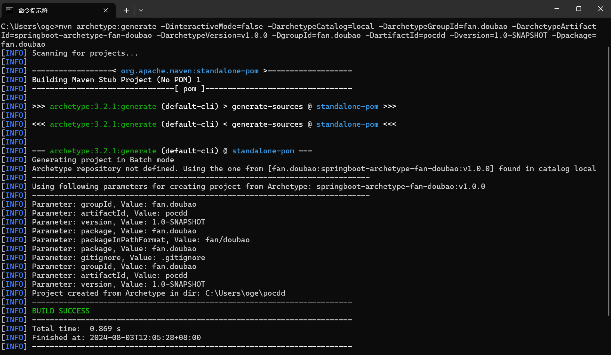
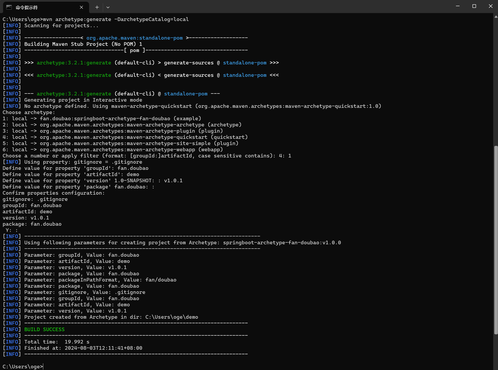
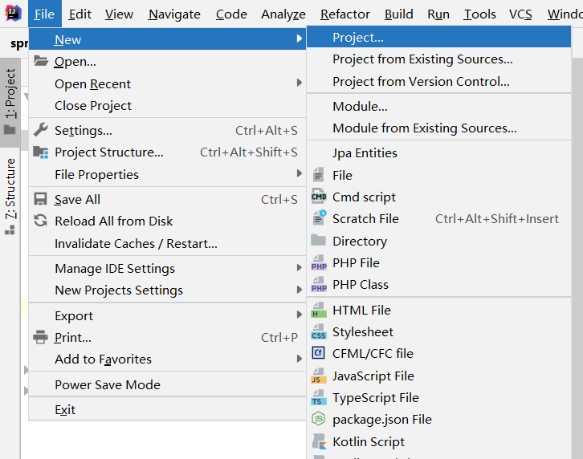
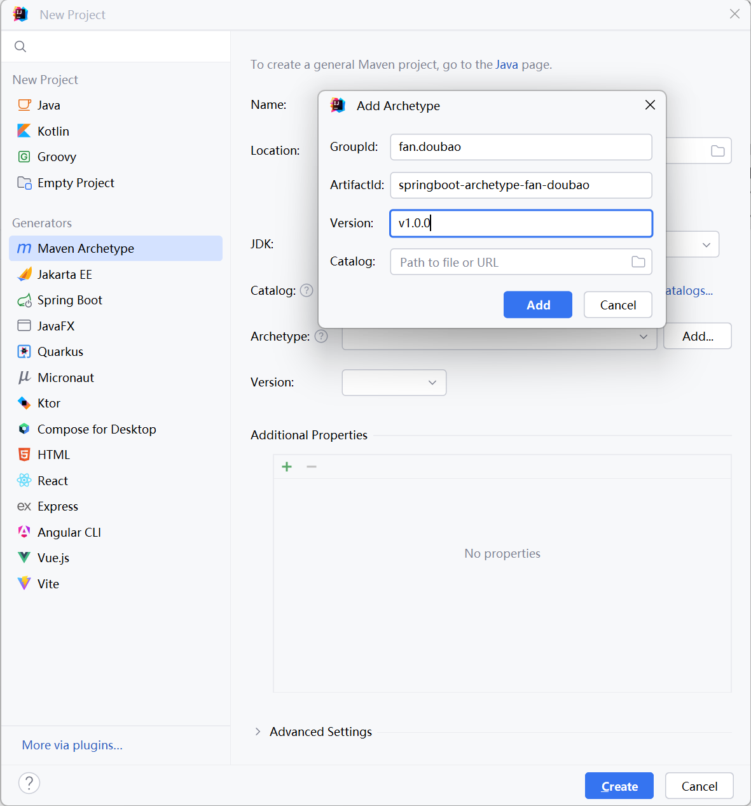
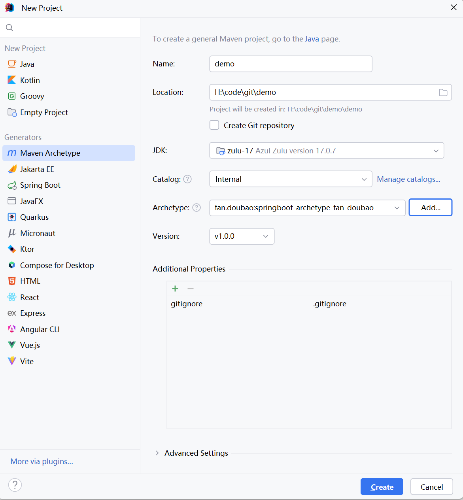
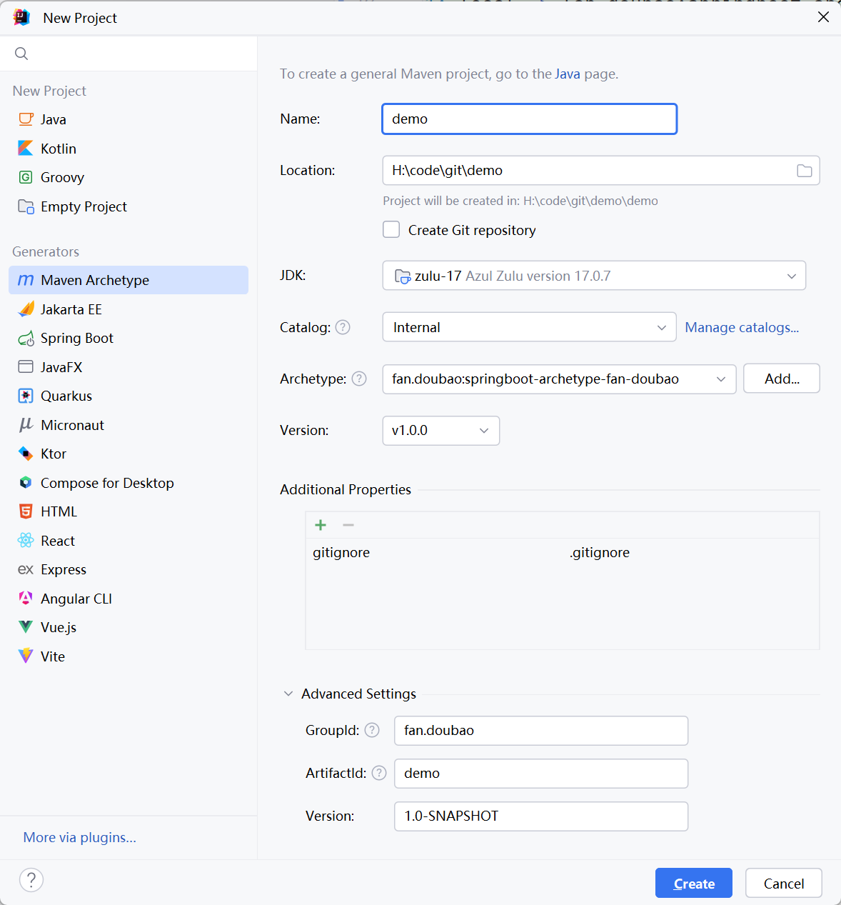
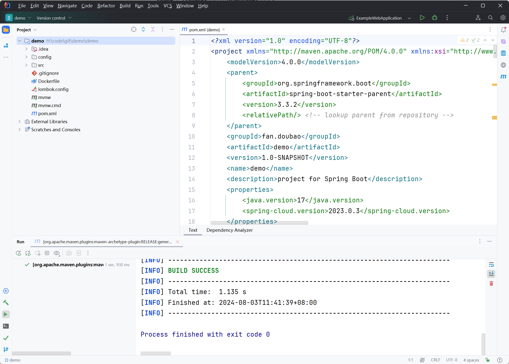

# SpringBoot Archetype

> Spring Boot Archetype 将帮助你快速生成 Spring Boot 项目。

## 注意！

* 不要直接运行本项目，本项目是制作`maven archetype模板`的模板
* 本项目依赖于 Lombok 插件，请在 IDE 中安装 `Lombok Plugin`
* 此项目构建archetype需要maven添加到环境变量中，不然无法运行下面的mvn命令

## 前置条件

* [JDK 17](https://www.azul.com/downloads/?version=java-17-lts&os=windows&architecture=x86-64-bit&package=jdk#zulu)
* [Maven 3.9.8](http://maven.apache.org/download.cgi)
* [Lombok](https://projectlombok.org)
## 特点

* 简化创建项目步骤
* 创建项目后直接构建相关依赖
* 此项目骨架只是引用了常用的依赖，可以新建项目后自行添加和删除

## 运行

### 创建模板

#### 第一步：将archetype打包发布到本地仓库

```shell
mvn clean install
```

#### 第二步：生成Catalog文件

Catalog文件中包含了所有的Archetype，可以用来展示本地仓库中所有可以使用的archetype

```shell
mvn archetype:crawl
```
生成的Catalog在默认在maven的repository目录下的archetype-catalog.xml中，里面有archetype信息。

到此为止，项目模板就制作完成了，下面是使用方法

### 如何使用archetype

#### 方法一：直接指定好参数

| 参数                | 描述                    | 默认值       |
| ------------------- | ----------------------- | ------------ |
| archetypeGroupId    | 模板GroupId             | 无           |
| archetypeArtifactId | 模板ArtifactId          | 无           |
| archetypeVersion    | 模板版本                | 1.0-SNAPSHOT |
| archetypeCatalog    | 插件默认的catalog的路径 | 无           |
| interactiveMode     | 是否以交互的方式生成    | true         |
| groupId             | 目标项目GroupId         | 无           |
| artifactId          | 目标项目ArtifactId      | 无           |
| version             | 目标项目版本            | 无           |
| package             | 目标项目根包名          | 无           |

在新建项目的目标目录中执行
```shell
mvn archetype:generate -DinteractiveMode=false -DarchetypeCatalog=local -DarchetypeGroupId=fan.doubao -DarchetypeArtifactId=springboot-archetype-fan-doubao -DarchetypeVersion=v1.0.0 -DgroupId=fan.doubao -DartifactId=pocdd -Dversion=1.0-SNAPSHOT -Dpackage=fan.doubao
```
执行完成如下

#### 方法二：交互方式
在新建项目的目标目录中执行
```shell
mvn archetype:generate -DarchetypeCatalog=local
```

插件默认的catalog的路径为remote,local，即远程仓库和本地仓库的，为了构建的速度，直接将catalog的路径设置为本地仓库

控制台输出：

```shell
Choose archetype:
1: local -> fan.doubao:springboot-archetype-fan-doubao (example)
2: local -> org.apache.maven.archetypes:maven-archetype-plugin (plugin)
3: local -> org.apache.maven.archetypes:maven-archetype-quickstart (quickstart)
4: local -> org.apache.maven.archetypes:maven-archetype-site-simple (plugin)
5: local -> org.apache.maven.archetypes:maven-archetype-webapp (webapp)
Choose a number or apply filter (format: [groupId:]artifactId, case sensitive contains): 3:
```

在这里进行archetype的选择，选择完成后就是输入定义的参数，构建成功之后就可以用了
执行完成如下


#### 方法三：使用IDEA

**第一步：File->New->Project...**




**第二步：将创建的maven模板添加到idea中**



**第三步：使用创建的maven archetypes模板**




**第四步：填写项目基本信息**




完成以上的步骤之后，项目就创建完成了，项目结构如下：

